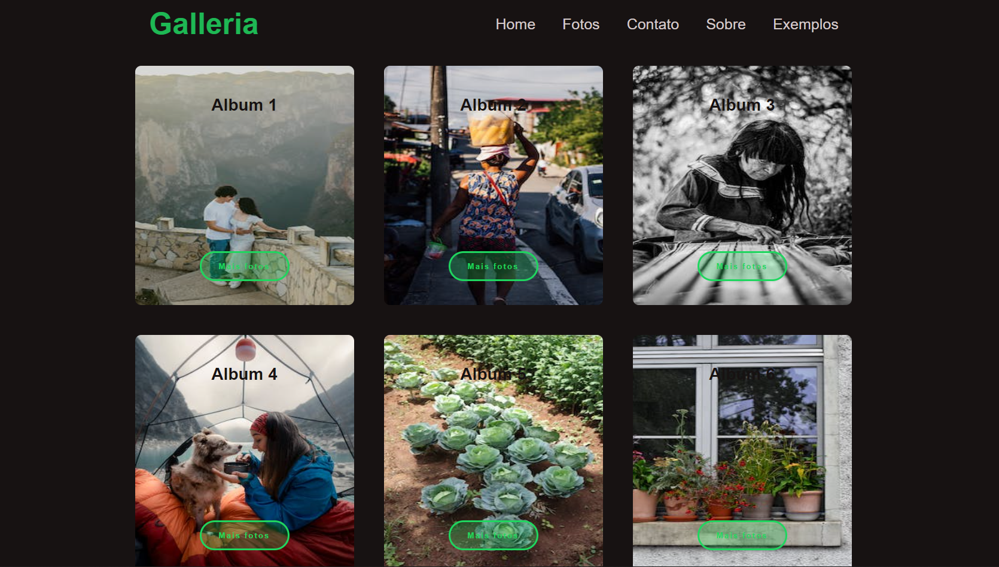

# Galleria em SvelteKit

> A aplicação é desenvolvida com SvelteKit, aproveitando os conceitos de roteamento, componentes, gerenciamento de estado e manipulação de dados por meio de APIs para oferecer uma experiência dinâmica e responsiva.

No projeto, foram explorados os recursos do SvelteKit para criar uma estrutura de roteamento eficiente, permitindo a navegação entre páginas de forma suave. Componentes reutilizáveis foram utilizados para facilitar a organização e modularização do código. O gerenciamento de estado foi implementado para controlar as interações do usuário e fornecer uma experiência interativa. Além disso, a manipulação de dados por meio de APIs externas foi incorporada para obter e atualizar informações de forma dinâmica.

* Este projeto foi desenvolvido como parte do trabalho de Programação III do curso de ADS, com o objetivo de aplicar e aprofundar os conceitos aprendidos durante o curso.

## Conceitos abordados

- SvelteKit
    - Client-side rendering (CSR).
    - Server-side rendering (SSR).
    - Roteamento
    - Gerenciamento de estado
    - Componentes
    - onMount
    - Carregamento de dados

- API
    - Get
    - Post

## 🚀 Assessando o projeto

Para acessar o projeto, basta [clicar aqui]() 
 

## 📝 Licença

Esse projeto está sob licença. Veja o arquivo [LICENÇA](LICENSE.md) para mais detalhes.

[⬆ Voltar ao topo](#Galleria-em-SvelteKit) 
